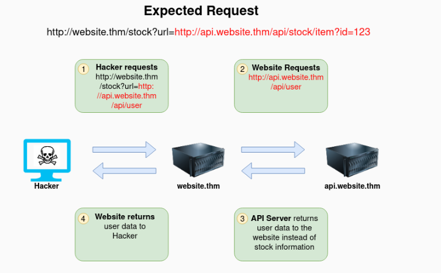

# SSRF Theory

Example #1

The below example shows how the attacker can have complete control over the page requested by the webserver. The Expected Request is what the website.thm server is expecting to receive, with the section in red being the URL that the website will fetch for the information. The attacker can modify the area in red to an URL of their choice.

<figure><figcaption></figcaption></figure>

Example 2

The below example shows how the attacker can have complete control over the page requested by the webserver. The Expected Request is what the website.thm server is expecting to receive, with the section in red being the URL that the website will fetch for the information. The attacker can modify the area in red to an URL of their choice.

<figure><figcaption></figcaption></figure>

Example 3

The below example shows how an attacker can still reach the /api/user page with only having control over the path by utilising directory traversal. When website.thm receives ../ this is a message to move up a directory which removes the /stock portion of the request and turns the final request into /api/user

<figure><figcaption></figcaption></figure>

Example 4

In this example, the attacker can control the server's subdomain to which the request is made. Take note of the payload ending in **\&x=** being used to stop the remaining path from being appended to the end of the attacker's URL and instead turns it into a parameter (?x=) on the query string.

<figure><figcaption></figcaption></figure>

Example 5

Going back to the original request, the attacker can instead force the webserver to request a server of the attacker's choice. By doing so, we can capture request headers that are sent to the attacker's specified domain. These headers could contain authentication credentials or API keys sent by website.thm (that would normally authenticate to api.website.thm).

<figure><figcaption></figcaption></figure>
