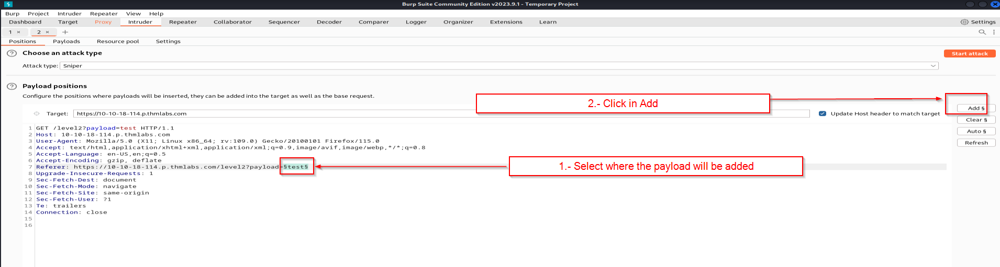
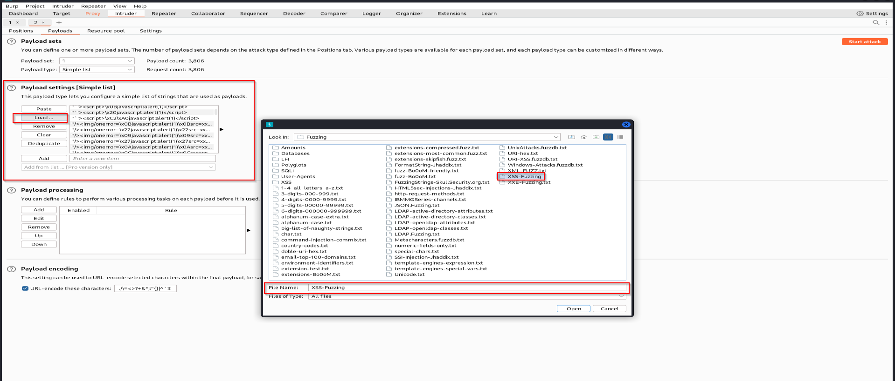

# Fuzzing

In kali, there are folder ready to be use for fuzzing, one of those is this:\
/opt/useful/SecLists/Fuzzing/

**Example doing a fuzzing with cross site scripting:**\
\

<figure><figcaption></figcaption></figure>

 

<figure><figcaption></figcaption></figure>

##
