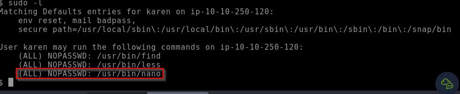
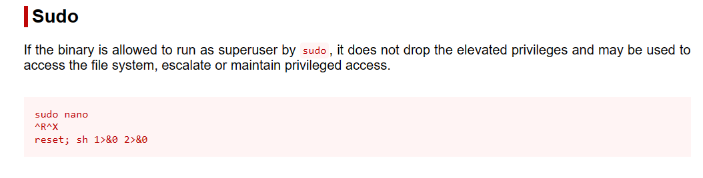

# Privilege escalation sudo

Any user can check its current situation related to root privileges using the `sudo -l` command.

Leverage LD\_PRELOAD

On some systems, you may see the LD\_PRELOAD environment option.

\

LD\_PRELOAD is a function that allows any program to use shared libraries. This [blog post](https://rafalcieslak.wordpress.com/2013/04/02/dynamic-linker-tricks-using-ld\_preload-to-cheat-inject-features-and-investigate-programs/) will give you an idea about the capabilities of LD\_PRELOAD. If the "env\_keep" option is enabled we can generate a shared library which will be loaded and executed before the program is run. Please note the LD\_PRELOAD option will be ignored if the real user ID is different from the effective user ID.\

The steps of this privilege escalation vector can be summarized as follows;

1. Check for LD\_PRELOAD (with the env\_keep option)
2. Write a simple C code compiled as a share object (.so extension) file
3. Run the program with sudo rights and the LD\_PRELOAD option pointing to our .so file

Example: In this case we have access to the user account "karen" when we check the sudo -l we have the following:

<figure><figcaption></figcaption></figure>

The sudo permission for /usr/bin/nano seems interesting we could investigate about techniques how to escalate privileges in: [https://gtfobins.github.io/](https://gtfobins.github.io/)

<figure><figcaption></figcaption></figure>
