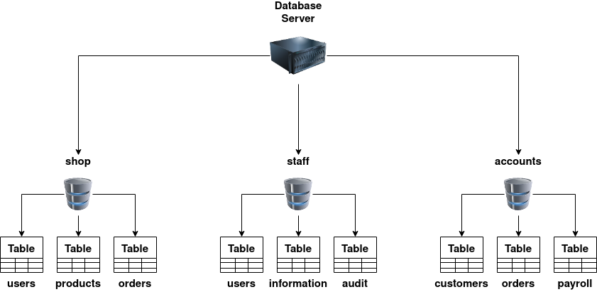

# Structured Query Language

SQL (Structured Query Language) Injection, mostly referred to as SQLi, is an attack on a web application database server that causes malicious queries to be executed. When a web application communicates with a database using input from a user that hasn't been properly validated, there runs the potential of an attacker being able to steal, delete or alter private and customer data and also attack the web applications authentication methods to private or customer areas. This is why as well as SQLi being one of the oldest web application vulnerabilities, it also can be the most damaging.

**What is a database?**

A database is a way of electronically storing collections of data in an organised manner. A database is controlled by a DBMS which is an acronym for  <mark style="background-color:orange;">**Database Management System**</mark>**,** DBMS's fall into two camps Relational or Non-Relational, the focus of this room will be on Relational databases,  some common one's you'll come across are MySQL, Microsoft SQL Server, Access, PostgreSQL and SQLite. We'll explain the difference between Relational and Non-Relational databases at the end of this task but first, it's important to learn a few terms.

Within a DBMS, you can have multiple databases, each containing its own set of related data. For example, you may have a database called "shop". Within this database, you want to store information about products available to purchase, users who have signed up to your online shop, and information about the orders you've received. You'd store this information separately in the database using something called tables, the tables are identified with a unique name for each one. You can see this structure in the diagram below, but you can also see how a business might have other separate databases to store staff information or the accounts team.

<figure><figcaption></figcaption></figure>

**`Relational Vs Non-Relational Databases:`**\
A relational database, stores information in tables and often the tables have shared information between them, they use columns to specify and define the data being stored and rows to actually store the data. The tables will often contain a column that has a unique ID (primary key) which will then be used in other tables to reference it and cause a relationship between the tables, hence the name relational database.

Non-relational databases sometimes called NoSQL on the other hand is any sort of database that doesn't use tables, columns and rows to store the data, a specific database layout doesn't need to be constructed so each row of data can contain different information which can give more flexibility over a relational database.  Some popular databases of this type are MongoDB, Cassandra and ElasticSearch.
