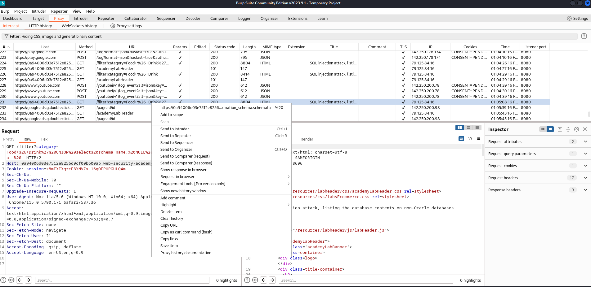

# Automating attack with burp suite

1.- Attacking manually until we found where could we insert the payload

<figure><figcaption></figcaption></figure>

2.- Go to Burpsuite, proxy , HTTP history, and <mark style="background-color:orange;">**sent to intruder**</mark> the request that successfully processed the payload.

<figure><figcaption></figcaption></figure>

3.- Insert where the payload will be loaded:

<figure><figcaption></figcaption></figure>

4.- Start the attack, a window will appear check Request and response and verify if it's working

<figure><figcaption></figcaption></figure>
