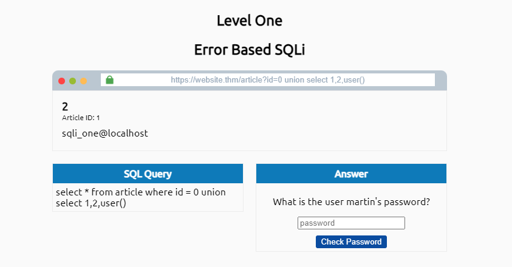
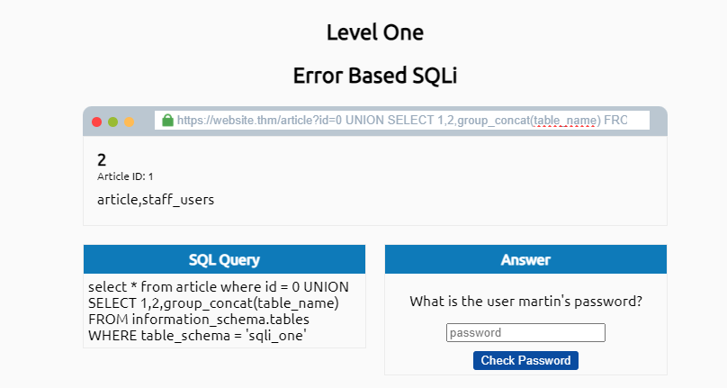
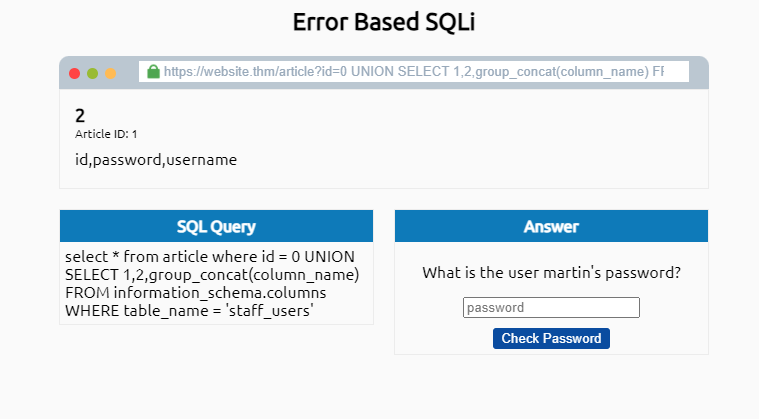
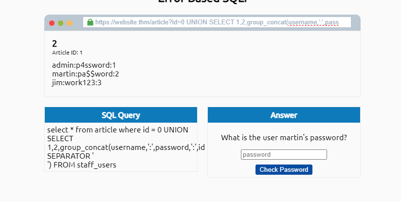

# Determining the number of columns

This is a practice from THM, where we have to determine the number of columns in this website:

<mark style="background-color:orange;">website.thm/article?id=1</mark>

We start with just a ' symbol, if it returns an error it means we could interact with SQL

<figure><figcaption></figcaption></figure>

Then, in order to be able to generate commands we first need to detect the number of colums it could be done with the following query:

<mark style="background-color:orange;">UNION select 1,2,3,N (Until it not returns an error)</mark>

<figure><figcaption></figcaption></figure>

Once we detect the number of columns, we could start to try to generate the output to the screen to do it, just try to move to ARTICLE 0, and add some SQL commands like "user()" to verify who is running or this ones:

version()= Obtain linux version.

database() = Obtain DB name.&#x20;

The next movement is to determine the number of tables available for this just put the following command:\
<mark style="color:green;background-color:orange;">UNION SELECT 1,2,group\_concat(table\_name) FROM information\_schema.tables WHERE table\_schema = 'sqli\_one'</mark>

Remember: We have obtain the database name from the command database()

<figure><figcaption></figcaption></figure>

Now, we have to find some credentials, it could be possible its inside "staff\_users" table, let's type the following command to obtain the columns available

<figure><figcaption></figcaption></figure>

Now to obtain the data from username and password use this syntax:

0 UNION SELECT 1,2,group\_concat(username,':',password SEPARATOR '\ ') FROM staff\_users

test line:

0 UNION SELECT 1,2,group\_concat(username,':',password,':',id SEPARATOR '\ ') FROM staff\_users

<figure><figcaption></figcaption></figure>
