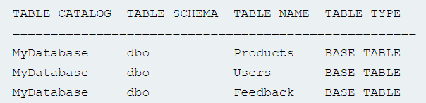
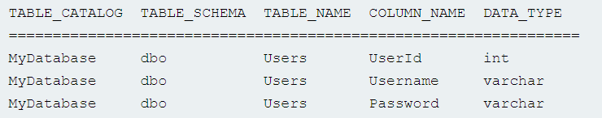

# Listing the contents of the database

Most database types (except Oracle) have a set of views called the information schema. This provides information about the database.

For example, you can query `information_schema.tables` to list the tables in the database:

`SELECT * FROM information_schema.tables`

This returns output like the following:

<figure><figcaption></figcaption></figure>

This output indicates that there are three tables, called `Products`, `Users`, and `Feedback`.

You can then query `information_schema.columns` to list the columns in individual tables:

`SELECT * FROM information_schema.columns WHERE table_name = 'Users'`

This returns output like the following:

<figure><figcaption></figcaption></figure>

This output shows the columns in the specified table and the data type of each column.
