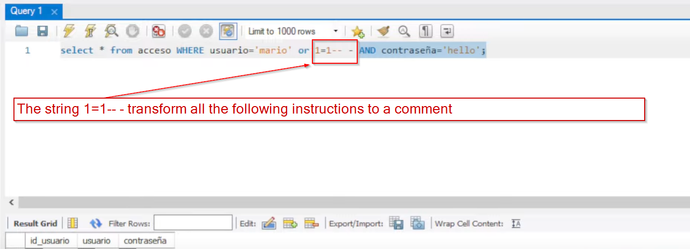

# SQL explanation from "El pingüino de Mario"

In the explanation we are using a HTB machine with a webpage login

<figure><figcaption></figcaption></figure>

 

<figure><figcaption></figcaption></figure>

The request comes in the following query:

select \* from acceso WHERE usuario='mario' AND contraseña='1234';

### 1=1-- - Explanation

<figure><figcaption>
If we execute this it will return all the users in the DATABASE
</figcaption></figure>

The instruction above could be read like = Select from table "acceso" the user 'mario' or "everything else". It doesn't matter if the user doesn't exist

Also it could be done like this mario'--

<figure><figcaption></figcaption></figure>
